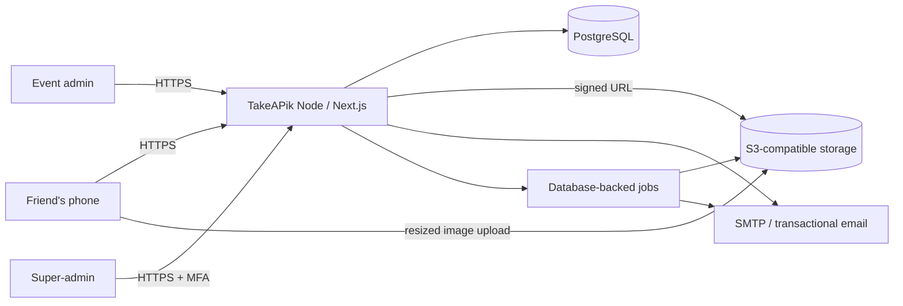
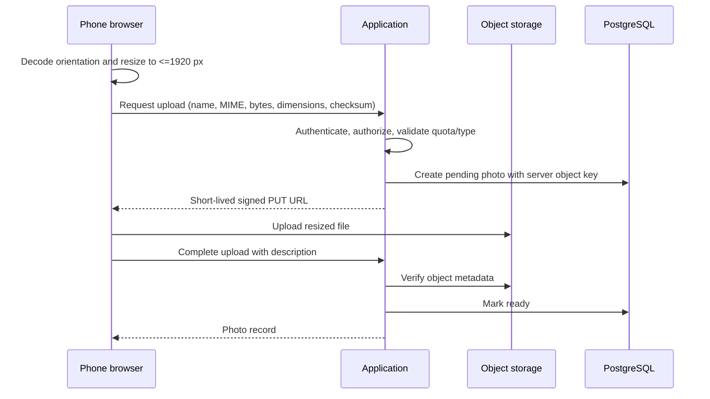

# TakeAPik architecture

## Goals and constraints

TakeAPik supports private event albums, fast phone uploads, tenant subdomains, friend access without passwords, event administration, platform administration, email invitations, and downloadable album exports. Initial operations should fit one Hostinger Node.js deployment without preventing later scale-out.

Out of scope for the first release: native apps, video, public albums, social features, facial recognition, comments, likes, and multi-event tenants.

## System context

## Deployment shape

Begin with a modular monolith:

- **Next.js application:** UI, route handlers, authentication, authorization, tenant resolution.
- **PostgreSQL:** users, tenants, events, memberships, sessions, photo metadata, invitations, audit log, and initial job queue.
- **Object storage:** photos, thumbnails, and expiring ZIP exports. Never place album media on the application filesystem.
- **Worker process:** email delivery, thumbnails if needed, export ZIP assembly, cleanup. It may share the repository but runs separately from web traffic.

This is easier to deploy and transact than early microservices. Separate the worker or media service only when metrics show resource contention.

## Request and tenant flow

1. Reverse proxy preserves the original `Host` header and terminates TLS.
2. The application normalizes the host and accepts only `takeapik.com`, `www.takeapik.com`, or a single valid tenant label under `takeapik.com`.
3. Reserved labels are rejected. Tenant slug is looked up server-side; archived/missing tenants receive a non-enumerating response.
4. Authentication establishes an actor. Authorization compares actor tenant to resolved tenant.
5. Services receive explicit tenant context. Repositories query by both resource ID and `tenant_id`.

Local development uses `*.localhost` or `DEV_TENANT_SLUG`.

## Authentication model

- **Friend:** event name + normalized email + eight-digit event code. All three must match the resolved tenant. Create a random opaque session, store only its hash, and set a host-only 24-hour cookie.
- **Event admin:** email/password, Argon2id hash, login throttling, and MFA before production launch. Admin sessions should be shorter or require reauthentication for code rotation/export.
- **Super-admin:** separate root-domain portal, mandatory MFA, no tenant-subdomain login, step-up authentication for provisioning/archive actions.
- **Invitation links:** single-use, high-entropy token. A link selects the event/membership but does not embed or reveal the shared eight-digit code.

## Upload sequence

HEIC/HEIF decode support differs by browser. Phase 3 should feature-detect it and use a maintained client decoder only where required. The server accepts final JPEG, PNG, or WebP; it never trusts the filename or client-reported dimensions.

## Gallery and exports

The gallery uses cursor pagination ordered by `(created_at DESC, id DESC)`, responsive CSS columns/masonry, lazy loading, and blur/thumbnail placeholders. The UI should virtualize or prune distant nodes after measurement shows memory pressure.

Only an event admin can request a full export. A background job streams tenant objects into a ZIP, writes it to a private export prefix, and sends a short-lived download link. Exports expire and are deleted automatically.

## Archival lifecycle

`draft → active → archived`. Archive sets `archived_at`, revokes sessions/invites, disables mutations, and schedules media retention according to policy. Unarchive is intentionally not a first-release operation; restoration requires a super-admin runbook and audit event.

## Scalability thresholds

- Add Redis for sessions/rate limits/jobs when more than one web instance is needed or database queue latency becomes material.
- Move image verification and exports to dedicated workers when CPU or I/O affects request latency.
- Add a CDN before object storage when cross-region gallery latency is visible.
- Partition or archive `audit_logs` only after measured table growth warrants it.

## ADR-001: Modular monolith on Hostinger

**Status:** Accepted  
**Date:** 2026-08-18

**Decision:** Use a single TypeScript/Next.js codebase, PostgreSQL, S3-compatible media storage, and a separately runnable worker.

**Options considered:** a modular monolith, serverless functions, and microservices. The monolith has the lowest operational overhead and simplest transactions for the expected launch scale. Serverless complicates Hostinger deployment and long export jobs; microservices introduce coordination and observability costs too early.

**Consequences:** deployment and local development stay simple. Module boundaries and background jobs must be maintained carefully so media work can be extracted later.

## ADR-002: Hostname-derived tenancy

**Status:** Accepted  
**Date:** 2026-08-18

**Decision:** Resolve tenants from one validated subdomain label and enforce tenant scope in all repositories.

**Alternatives:** tenant path prefixes and user-provided tenant IDs. Subdomains match the product experience and provide host-only cookie isolation; user-provided IDs are insecure as an authority source.

**Consequences:** wildcard DNS/TLS and trusted-proxy configuration are required. Local development needs a documented hostname strategy.
