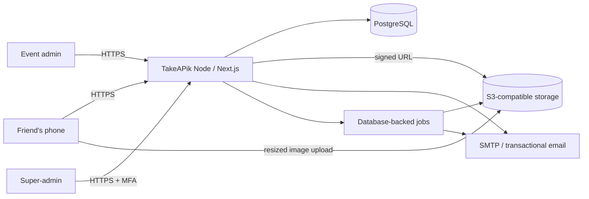
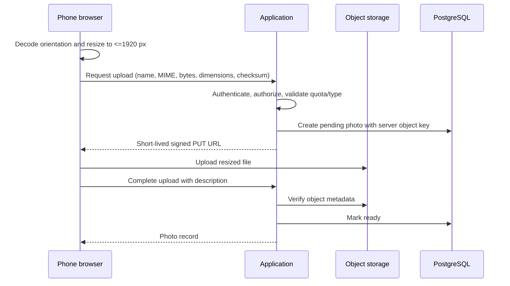

# TakeAPik architecture

## Goals and constraints

TakeAPik supports private event albums, fast phone uploads, tenant subdomains, friend access without passwords, event administration, platform administration, email invitations, and downloadable album exports. Initial operations should fit one Hostinger Node.js deployment without preventing later scale-out.

Out of scope for the first release: native apps, video, public albums, social features, facial recognition, comments, likes, and multi-event tenants.

## System context

## Deployment shape

Begin with a modular monolith:

- **Next.js application:** UI, route handlers, authentication, authorization, tenant resolution.
- **PostgreSQL:** users, tenants, events, memberships, sessions, photo metadata, invitations, audit log, and initial job queue.
- **Object storage:** photos, thumbnails, and expiring ZIP exports. Never place album media on the application filesystem.
- **Worker process:** email delivery, thumbnails if needed, export ZIP assembly, cleanup. It may share the repository but runs separately from web traffic.

This is easier to deploy and transact than early microservices. Separate the worker or media service only when metrics show resource contention.

## Request and tenant flow

1. Reverse proxy preserves the original `Host` header and terminates TLS.
2. The application normalizes the host and accepts only `takeapik.com`, `www.takeapik.com`, or a single valid tenant label under `takeapik.com`.
3. Reserved labels are rejected. Tenant slug is looked up server-side; archived/missing tenants receive a non-enumerating response.
4. Authentication establishes an actor. Authorization compares actor tenant to resolved tenant.
5. Services receive explicit tenant context. Repositories query by both resource ID and `tenant_id`.

Local development uses `*.localhost` or `DEV_TENANT_SLUG`.

## Authentication model

- **Friend:** event name + normalized email + eight-digit event code. All three must match the resolved tenant. Create a random opaque session, store only its hash, and set a host-only 24-hour cookie.
- **Event admin:** email/password, Argon2id hash, login throttling, and MFA before production launch. Admin sessions should be shorter or require reauthentication for code rotation/export.
- **Super-admin:** separate root-domain portal, mandatory MFA, no tenant-subdomain login, step-up authentication for provisioning/archive actions.
- **Invitation links:** single-use, high-entropy token. A link selects the event/membership but does not embed or reveal the shared eight-digit code.

## Upload sequence

HEIC/HEIF decode support differs by browser. Phase 3 should feature-detect it and use a maintained client decoder only where required. The server accepts final JPEG, PNG, or WebP; it never trusts the filename or client-reported dimensions.

## Gallery and exports

The gallery uses cursor pagination ordered by `(created_at DESC, id DESC)`, responsive CSS columns/masonry, lazy loading, and blur/thumbnail placeholders. The UI should virtualize or prune distant nodes after measurement shows memory pressure.

Only an event admin can request a full export. A background job streams tenant objects into a ZIP, writes it to a private export prefix, and sends a short-lived download link. Exports expire and are deleted automatically.

## Archival lifecycle

`draft → active → archived`. Archive sets `archived_at`, revokes sessions/invites, disables mutations, and schedules media retention according to policy. Unarchive is intentionally not a first-release operation; restoration requires a super-admin runbook and audit event.

## Scalability thresholds

- Add Redis for sessions/rate limits/jobs when more than one web instance is needed or database queue latency becomes material.
- Move image verification and exports to dedicated workers when CPU or I/O affects request latency.
- Add a CDN before object storage when cross-region gallery latency is visible.
- Partition or archive `audit_logs` only after measured table growth warrants it.

## ADR-001: Modular monolith on Hostinger

**Status:** Accepted  
**Date:** 2026-08-18

**Decision:** Use a single TypeScript/Next.js codebase, PostgreSQL, S3-compatible media storage, and a separately runnable worker.

**Options considered:** a modular monolith, serverless functions, and microservices. The monolith has the lowest operational overhead and simplest transactions for the expected launch scale. Serverless complicates Hostinger deployment and long export jobs; microservices introduce coordination and observability costs too early.

**Consequences:** deployment and local development stay simple. Module boundaries and background jobs must be maintained carefully so media work can be extracted later.

## ADR-002: Hostname-derived tenancy

**Status:** Accepted  
**Date:** 2026-08-18

**Decision:** Resolve tenants from one validated subdomain label and enforce tenant scope in all repositories.

**Alternatives:** tenant path prefixes and user-provided tenant IDs. Subdomains match the product experience and provide host-only cookie isolation; user-provided IDs are insecure as an authority source.

**Consequences:** wildcard DNS/TLS and trusted-proxy configuration are required. Local development needs a documented hostname strategy.

## ADR-003: Two-factor guest login (email + access code)

**Status:** Accepted (supersedes the three-field guest login in ADR-002's flow)
**Date:** 2026-08-18

**Decision:** Guest login asks for the member email and the event's eight-digit access code only. The event name is no longer a login input; the tenant is identified by the hostname (or, on the root domain, located from the email+code pair via the single-use handoff).

**Context:** Real users found three fields too complicated, and the event name added no meaningful security: it is printed on invitations and easily guessed, while tenant identity already comes from the validated hostname. The email (selective) and the random access code (secret, keyed-slow-hashed) carry all the security weight.

**Consequences:** Login forms are two fields. Root-domain locate matches by email and verifies the code against each candidate album (bounded, email-selective). Failure responses stay generic and rate limits are unchanged. `docs/SECURITY.md` and `CLAUDE.md` invariants updated to match.

## ADR-004: Path-based tenancy on a single albums subdomain

**Status:** Accepted (supersedes ADR-002's subdomain-per-tenant hostname routing)
**Date:** 2026-08-19

**Decision:** Every album lives at `albums.takeapik.com/a/:slug`. The main domain (`takeapik.com`) hosts only the marketing landing and the super-admin portal; all guest/admin login and album pages live on the single `albums.takeapik.com` subdomain, with the album identified by the URL path. A Next middleware enforces the split: `/a/*` requested on the main domain redirects to the albums subdomain, and `/super-admin` on the albums subdomain redirects to the main domain.

**Context:** The production host is Hostinger shared hosting, which cannot issue a wildcard TLS certificate or route arbitrary `*.takeapik.com` subdomains to the Node app — so the original subdomain-per-album model (ADR-002) could not serve albums there. A single, static subdomain needs only one certificate and one route, which shared hosting does support, while the path carries the album identity.

**Security consequence — the cookie is no longer the isolation boundary.** ADR-002 relied on host-only cookies so one album's session could not be sent to another album's origin. With all albums on one origin, that isolation moves entirely into the application: the session row binds an actor to exactly one `tenant_id`; every tenant-owned query is scoped by that id; and album pages additionally verify the session's tenant matches the `:slug` in the path before rendering. A session therefore cannot read or mutate another album's data regardless of the URL. Cross-tenant path access (`session for A` visiting `/a/B`) is treated as unauthenticated for B. The super-admin portal stays on its own host, so its cookie never mixes with album sessions.

**Consequence:** No wildcard DNS/TLS is required — only one `albums` subdomain pointed at the app. The cross-subdomain login handoff from ADR-002 is removed, since login and album pages share one origin. Invitation links are `albums.takeapik.com/a/:slug/invite`.

## ADR-005: Single-origin deployment with defense-in-depth

**Status:** Accepted (supersedes ADR-004's albums subdomain split)
**Date:** 2026-08-19

**Decision:** The entire product runs on one origin, `takeapik.com`: marketing, guest login, albums at `/a/:slug`, and the super-admin portal at `/super-admin`. There is no albums subdomain.

**Context:** The production host (Hostinger shared hosting) cannot route a second hostname to the Node app or issue a certificate for it, so the `albums.takeapik.com` split of ADR-004 was not serveable there. Keeping everything on the one working origin is the pragmatic choice; the album still lives in the path (`/a/:slug`).

**Security model — the session is the isolation boundary, backed by defense-in-depth.** Because all albums share one origin, isolation cannot rely on the cookie's host. It is enforced in layers:
- The session row binds an actor to exactly one `tenant_id`; every tenant-owned query is scoped by it, so a session cannot read or mutate another album's rows regardless of the URL.
- Album pages additionally verify the session's tenant matches the `:slug` before rendering; a mismatch is treated as unauthenticated for that album.
- Session cookies are `HttpOnly; Secure; SameSite=Lax`, so client script cannot read them and cross-site requests cannot ride them; mutations also require an origin / `Sec-Fetch-Site` check.
- A strict, per-request nonce **Content-Security-Policy** (`default-src 'self'`, `script-src` nonce + `strict-dynamic`, `object-src 'none'`, `frame-ancestors 'none'`, `base-uri 'self'`) blocks injected scripts from exfiltrating data — the main added risk of a shared origin. HSTS, `X-Frame-Options: DENY`, `X-Content-Type-Options: nosniff`, COOP, and CORP are set on every response.
- Photo bytes never touch the app origin: originals live in a **private** object-storage bucket under non-guessable, tenant-prefixed, server-generated keys, and are served only through short-lived signed URLs. `Referrer-Policy: strict-origin-when-cross-origin` keeps those URLs out of referers.

**Consequence:** No wildcard or second-host DNS/TLS is needed. The super-admin portal shares the origin, so its session is separated from album sessions only by role checks (a super-admin session is never treated as an album member). Photo-leak resistance depends on the object-storage bucket being private with signed-URL access — a launch requirement, not optional.
